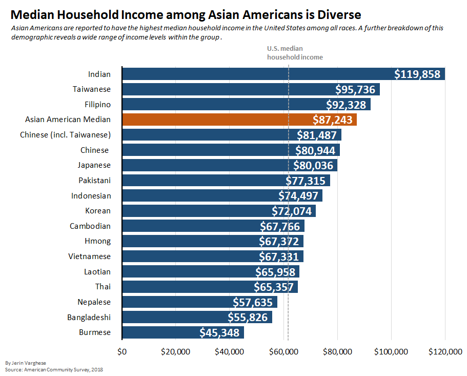

# Median Household Income among Asian Americans

The U.S. Census Bureau reports Asians as the race with the highest median household income, as can be seen [here](https://www.census.gov/content/dam/Census/library/visualizations/2018/demo/p60-263/figure1.pdf). 
However, looking at this demographic at a more disaggregate level reveals a diverse socioeconomic experience within the group itself.
				

